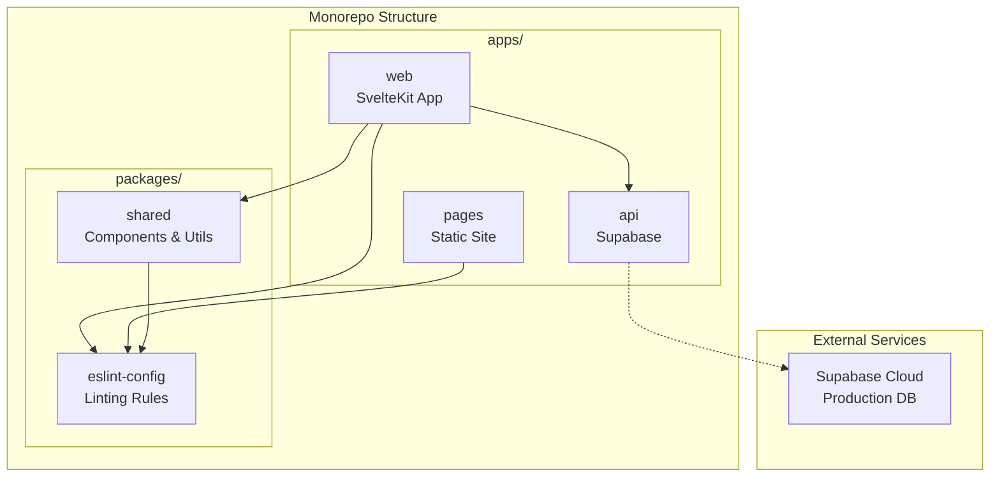

# WebApp Template

Monorepo template for creating a modern web application.

## Tech Stack

- **Frontend**: [Svelte 5](https://svelte.dev/) + [SvelteKit](https://svelte.dev/docs/kit/) + [TypeScript](https://www.typescriptlang.org/) + [Tailwind CSS 4](https://tailwindcss.com/) + [shadcn-svelte](https://github.com/huntabyte/shadcn-svelte) + [Lucide Svelte](https://lucide.dev/guide/packages/lucide-svelte) + [Superforms](https://superforms.rocks/) + [Valibot](https://valibot.dev/)
- **API**: [Supabase](https://supabase.com/) (PostgreSQL, Auth, Realtime, Storage)
- **Build System**: [Turborepo](https://turborepo.org/) + [Bun](https://bun.sh/) + [Vite](https://vitejs.dev/)
- **Quality Tools**: [ESLint 9](https://eslint.org/), [Prettier](https://prettier.io/), [CSpell](https://cspell.org/), [markuplint](https://markuplint.dev/)
- **Development**: VS Code extensions, [lint-staged](https://github.com/okonet/lint-staged), [husky](https://github.com/typicode/husky), GitHub Actions

## Apps and Packages

### `apps/`

- **[`api`](./apps/api/)** - [Supabase](https://supabase.com/) Local Development
  PostgreSQL database, authentication, and API services
- **[`web`](./apps/web/)** [[Demo](https://webapp-template.usagizmo.com/)] - [SvelteKit](https://svelte.dev/docs/kit/) Frontend
  Modern web application with page-based component organization, class-based design patterns, and comprehensive Supabase integration
- **[`pages`](./apps/pages/)** [[Demo](https://webapp-template-pages.usagizmo.com/)] - Static Site Publishing
  High-quality static websites with URL validation, accessibility checks, and SEO optimization

### `packages/`

- **[`shared`](./packages/shared/)** - Shared components, styles, types, constants, and utilities
  - UI Components: [shadcn-svelte](https://github.com/huntabyte/shadcn-svelte) components and custom components
  - Styles: `app.css` - Base Tailwind CSS styles
  - Shared logic: Types, constants, and utility functions
- **[`eslint-config`](./packages/eslint-config/)** - Centralized [ESLint 9](https://eslint.org/) configuration with Flat Config
  - Pre-configured setups: `root`, `web` (Svelte), `pages` (Vanilla JS)
  - [eslint-config-prettier](https://github.com/prettier/eslint-config-prettier) - Prettier integration
  - [eslint-plugin-svelte](https://github.com/sveltejs/eslint-plugin-svelte) - Svelte linting
  - [eslint-plugin-simple-import-sort](https://github.com/lydell/eslint-plugin-simple-import-sort) - Import sorting
  - [eslint-plugin-jsdoc](https://github.com/gajus/eslint-plugin-jsdoc) - JSDoc validation
  - [eslint-plugin-unused-imports](https://github.com/sweepline/eslint-plugin-unused-imports) - Unused import cleanup

## Architecture Overview



## Quick Start

### Prerequisites

- [Bun](https://bun.sh/)
- [Docker](https://www.docker.com/) (for local database)

### Starting Development

```bash
# Install dependencies (.env file is created automatically)
bun install

# For static site development
bun --filter pages dev

# For web app development
bun --filter api start     # Start Supabase API
bun --filter api generate  # Generate TypeScript types (only when schema changes)
bun --filter web dev       # Start web development server
```

> **Note**: TypeScript types are committed to the repository, so you only need to run `generate` when the database schema changes.

#### Environment Configuration

After running `bun install`, a `.env` file is automatically created from `.env.example`. Fill in the required values:

**For local development**:

- `PUBLIC_SUPABASE_URL` - `http://127.0.0.1:54321`
- `PUBLIC_SUPABASE_ANON_KEY` - Copy the anon key displayed when running `bun --filter api start`

**For production deployment**:

- `PUBLIC_SUPABASE_URL` - `https://[project-id].supabase.co`
- `PUBLIC_SUPABASE_ANON_KEY` - Get from Supabase Dashboard > Project Settings > API Keys

**Optional (for advanced operations)**:

- `DATABASE_URL` - Enables `bun --filter api push/pull` to target production database
- `SUPABASE_SERVICE_ROLE_KEY` - Server-side admin access for Edge Functions, Webhooks (never use in browser!)

### VS Code Extensions (Recommended)

- [Svelte for VS Code](https://marketplace.visualstudio.com/items?itemName=svelte.svelte-vscode)
- [ESLint](https://marketplace.visualstudio.com/items?itemName=dbaeumer.vscode-eslint)
- [Prettier](https://marketplace.visualstudio.com/items?itemName=esbenp.prettier-vscode)
- [Tailwind CSS IntelliSense](https://marketplace.visualstudio.com/items?itemName=bradlc.vscode-tailwindcss)
- [EditorConfig](https://marketplace.visualstudio.com/items?itemName=EditorConfig.EditorConfig)

## Available Commands

### Root Level Commands

Run across every app and package from the repo root:

```bash
bun install     # Install dependencies (.env file is created automatically)
bun dev         # Start all development servers
bun build       # Build all apps and packages
bun check       # Type-check all apps
bun lint        # Lint all apps and packages
bun format      # Format all apps and packages
bun test        # Run all tests
```

Scope any command to a single app or package with `--filter`:

```bash
bun --filter api start      # Start Supabase API (port 54321)
bun --filter web dev        # Start the web app only (port 5173)
bun --filter pages dev      # Start the static site only (port 3000)
bun --filter api generate   # Generate TypeScript types from Supabase
```

### App-Specific Commands

#### API (Supabase)

```bash
cd apps/api
bun start            # Start Supabase locally
bun stop             # Stop Supabase
bun status           # Show Supabase service status
bun reset            # Reset database and regenerate types
bun generate         # Generate TypeScript types
bun test             # Run Supabase tests
bun lint             # Run linting
bun format           # Format code
```

#### Web App

```bash
cd apps/web
bun dev              # Start development server (port 5173)
bun build            # Build for production
bun preview          # Preview production build
bun check            # Run type checking with svelte-check
bun check:watch      # Type checking in watch mode
bun test             # Run tests
bun test:watch       # Run tests in watch mode
bun lint             # Run linting
bun format           # Format code
```

#### Pages (Static Site Publishing)

```bash
cd apps/pages
bun dev              # Start development server (port 3000)
bun build            # Build static site with Tailwind CSS
bun test             # Validate links, images, and accessibility
bun test:watch       # Run tests in watch mode
bun test:update      # Update test snapshots such as tests/external-links.txt
bun lint             # Run HTML validation with markuplint
bun format           # Format with Prettier
bun run deploy       # Deploy public/ to DEPLOY_TARGET with rsync

# Optimization Utilities
bun add-size-to-img  # Add width/height to  tags for better performance
bun clean-images     # Remove unused images from project
bun clean-images -n  # Preview unused image removals
```

## Port Configuration

| Service           | Port  | Description                  |
| ----------------- | ----- | ---------------------------- |
| Supabase API      | 54321 | REST API, GraphQL, Storage   |
| Supabase DB       | 54322 | PostgreSQL database          |
| Supabase Studio   | 54323 | Admin dashboard              |
| Supabase Inbucket | 54324 | Email testing                |
| Web App           | 5173  | SvelteKit development server |
| Pages             | 3000  | Static site with BrowserSync |

## Type Safety and Environment Switching

### Supabase Type Generation

TypeScript types are automatically generated from your Supabase database schema:

1. **Local Development**: Types are generated to `apps/api/$generated/types.ts`
2. **Frontend Usage**: Types are imported from the `api` package (e.g., `import type { Database } from 'api/types'`)
3. **After Schema Changes**: Run `bun generate` to update types

### Shared Components and Types

Common components, types, and constants are imported from the `@repo/shared` package. See [packages/shared](./packages/shared/) for the available exports and usage examples.

### Environment Switching

You can easily switch between development and production environments:

1. **For Development**: Use local Supabase (started with `bun start`)
2. **For Production Testing**: Update `.env` with production Supabase credentials
3. **Type Safety**: Types are committed to repository for CI/CD compatibility

## Deployment

### Vercel Deployment

The project supports deploying both apps as separate Vercel projects. Each app includes its own `vercel.json` configuration file.

#### Web App (SvelteKit)

**Configuration:**

- **Framework Preset**: SvelteKit
- **Root Directory**: `apps/web`
- **Build Command**: Automatically configured via `apps/web/vercel.json`
- **Install Command**: Automatically configured via `apps/web/vercel.json`

**Environment Variables:**
Set the following environment variables in your Vercel project settings:

```env
PUBLIC_SUPABASE_URL=https://your-project.supabase.co
PUBLIC_SUPABASE_ANON_KEY=your-anon-key
```

#### Static Pages

##### Option 1: Vercel Deployment

- **Framework Preset**: Other
- **Root Directory**: `apps/pages`
- **Build Command**: Automatically configured via `apps/pages/vercel.json`
- **Install Command**: Automatically configured via `apps/pages/vercel.json`
- **Output Directory**: `public`

##### Option 2: Server Deployment (rsync)

- Use `bun run deploy` command in `apps/pages`
- Configure `DEPLOY_TARGET` in `apps/pages/commands/deploy.js`
- Ensure SSH access and rsync are available for your target server
- Direct file transfer to your server

#### Setup Instructions

1. Create two separate Vercel projects from the same GitHub repository
2. Set different **Root Directory** for each project:
   - Web App: `apps/web`
   - Static Pages: `apps/pages`
3. Each project will use its respective `vercel.json` configuration
4. Configure environment variables for the web app project

## Changelog

See [CHANGELOG.md](./CHANGELOG.md) for highlights of notable and breaking changes. For the complete history, see the [GitHub Releases](https://github.com/usagizmo/webapp-template/releases).
